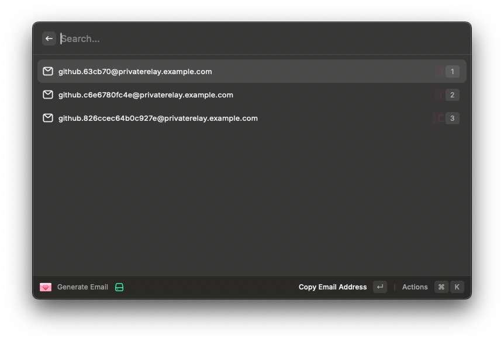

## 💌 Email Generator



The Random Email Generator allows you to effortlessly create unique email addresses for wildcard domains. By leveraging the active browser tab and random hexadecimal strings, this tool ensures each email generated is distinct and tailored to your current online context.

## ⛳ Features

* Wildcard Domain Support: Generate emails specifically for wildcard domains (e.g., privaterelay.example.com).
* Context-Aware: Utilizes the active browser tab to create relevant email addresses.
* Unique Identifiers: Incorporates random hex strings for added uniqueness, minimizing the chances of duplication.

## 🧬 Installation

* Install the [Raycast](https://www.raycast.com/) app
* Install the [Browser Extension](https://www.raycast.com/browser-extension)
* Install this plugin

## 🏗️ Development

* Node 22.5

```bash
npm install
npm test
npm run dev
```

## 🙋🏼 How to Use

1. Open a webpage where you want to create a unique email address.
2. Activate the plugin to generate a random email address based on the current site.

## ⛰️ Inspiration

* [💌 Alfred Email Generator](https://github.com/mxbaylee/email-generator)
